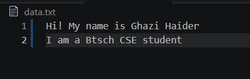
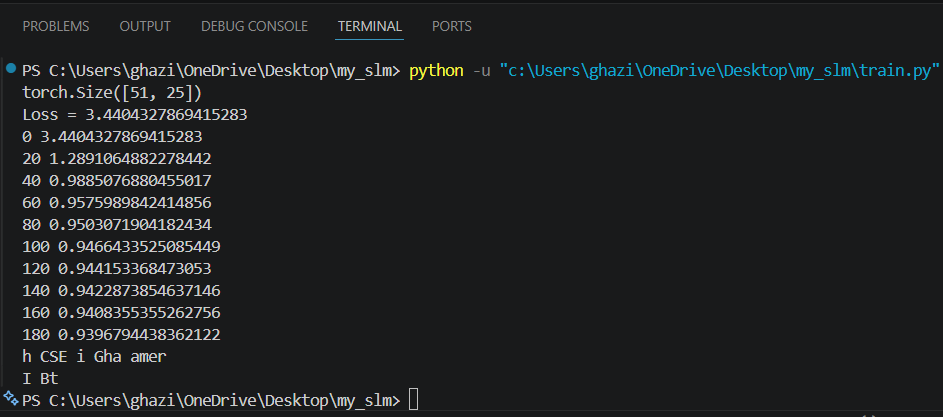

# 🧠 My SLM - Small Language Model

A simple character-level language model built from scratch using PyTorch. This project demonstrates the fundamental concepts behind modern Large Language Models (LLMs), including tokenization, embeddings, next-token prediction, training, and text generation.

---

## 📖 Project Overview

This project trains a neural network to predict the next character in a sequence. After training on a text dataset, the model learns character relationships and generates new text based on the learned patterns.

The goal of this project is to understand how language models work internally before moving on to advanced architectures such as Transformers and GPT models.

---

## ✨ Features

- Character-level tokenization
- Vocabulary creation
- Character-to-index encoding
- Embedding layer using PyTorch
- Cross Entropy Loss training
- AdamW optimizer
- Next-character prediction
- Basic text generation
- Beginner-friendly implementation

---

## 🛠️ Technologies Used

- Python
- PyTorch

---

## 📂 Project Structure

```text
My_SLM/
│
├── assets/
│   ├── dataset.png
│   └── output.png
│
├── data.txt
├── train.py
├── requirements.txt
└── README.md
```

---

## 📸 Screenshots

### Training Dataset

The model is trained on a custom text dataset.



### Training Output

Loss decreases as the model learns character patterns from the dataset.



---

## ⚙️ Installation

Clone the repository:

```bash
git clone https://github.com/Haider-001/My_SLM.git
cd My_SLM
```

Create a virtual environment:

```bash
python -m venv .venv
```

Activate the environment:

### Windows

```bash
.venv\Scripts\activate
```

### Linux / Mac

```bash
source .venv/bin/activate
```

Install dependencies:

```bash
pip install -r requirements.txt
```

---

## ▶️ Run the Project

```bash
python train.py
```

The model will:

1. Read the dataset
2. Create a vocabulary
3. Train embeddings
4. Minimize prediction loss
5. Generate new text

---

## 🧠 Concepts Covered

- Tokenization
- Vocabulary Encoding
- Embeddings
- Neural Networks
- Cross Entropy Loss
- Gradient Descent
- AdamW Optimization
- Language Modeling
- Text Generation

---

## 🚀 Future Improvements

- Larger datasets
- Context windows
- Multi-layer neural networks
- Attention mechanism
- Transformer architecture
- Mini GPT implementation

---

## 👨‍💻 Author

**Ghazi Haider**

B.Tech CSE (Data Science & AI)  
Integral University

📧 itsghazihaider008@gmail.com

🔗 LinkedIn:  
https://www.linkedin.com/in/ghazi-haider-4a906336a

---

⭐ If you found this project interesting, consider giving it a star.